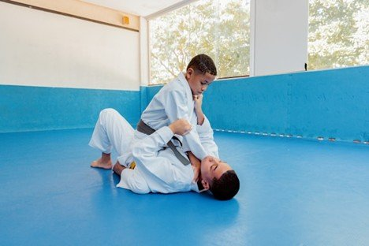

# From White Belt to Warrior: How Small Wins Lead to Big Growth

# From White Belt to Warrior: How Small Wins Lead to Big Growth

Jun 10

Written By [Webi Max](/blog?author=6480d62bd9ff5d5f7d3930b3)

When you first tie that crisp white belt around your waist, it’s hard not to feel both intimidated and inspired. The mat is full of seasoned grapplers, techniques you don’t yet understand, and a culture that feels both foreign and magnetic. But in Brazilian Jiu-Jitsu (BJJ), growth doesn’t happen overnight. It’s not earned with brute strength or flashy moves. It’s the result of countless small wins, accumulated over time - each one a stepping stone from white belt beginner to seasoned warrior.

## **The Humble Beginning**

Everyone begins their journey at the bottom. The white belt is more than just a starting point - it’s a rite of passage where your ego takes a backseat and your mental toughness is put to the test. In those early days, just showing up to class feels like a triumph. The language is unfamiliar, the positions are puzzling, and tapping out seems to happen more often than not.

Yet within that initial chaos lie the small victories that truly matter. Maybe it’s your first successful escape from side control. Or the moment your body finally remembers how to shrimp without thinking. Perhaps you make it through an entire round without getting submitted. These may seem like minor accomplishments, but they’re foundational wins. Each one sends a message to your nervous system: “You’re learning. Keep going.” For those training in [Brazilian Jiu Jitsu in Renton WA](https://www.ruffhouserenton.com/jiu-jitsu), these milestones are the building blocks of long-term growth and confidence on the mat.

The white belt phase teaches three vital things:

·         How to learn effectively.

·         How to lose with humility.

·         And how to see progress, even when it’s microscopic.

These lessons prepare you for what’s to come.

## **Finding Flow as a Blue Belt**

Earning your blue belt is a powerful milestone. You’ve committed. You’ve survived. You now have a functional understanding of positions, basic submissions, and defensive concepts. More importantly, you’re no longer drowning in every roll. You can breathe.

As a blue belt, your small wins start to evolve:

·         Executing a guard pass you drilled.

·         Catching a submission in live rolling without relying on strength.

·         Starting to impose your game instead of reacting to everyone else’s.

This is when many practitioners start to develop their style. Maybe you gravitate toward playing guard, or perhaps you prefer top pressure. You begin to experiment more confidently, knowing you won’t completely fall apart if something doesn’t go as planned.

But this phase also brings a new challenge: the blue belt blues - a period where progress feels slow or even nonexistent. You might feel stuck or unsure if you’re improving. This is where the mindset of valuing small wins becomes crucial. Measuring success based on taps or belts will burn you out. But tracking how often you escape mount, how quickly you recover guard, or how effectively you conserve energy? That’s where growth lives.

## **The Purple Belt Phase**

If white belt is survival and blue belt is foundation-building, then purple belt is where you start creating art. This belt is often referred to as the “thinking grappler’s belt,” and for good reason. You’re no longer just trying to remember techniques - you’re analyzing, adapting, and even innovating.

At this stage, you begin to connect the dots:

·         You understand why a move works, not just how to do it.

·         You build combinations - not isolated moves, but flowing transitions.

·         You recognize your go-to sequences and start refining them with precision.

Small wins now look like:

·         Setting traps two steps ahead of your opponent.

·         Adjusting grips mid-roll to set up a transition.

·         Coaching a newer student and recognizing how much you’ve truly learned.

As your confidence grows, so does your ability to teach, mentor, and contribute to the culture of your academy. Purple belt is often where warriors are forged - not just through skill, but through leadership, patience, and self-discipline.

## **Brown Belt**

[The brown belt is a unique period in a grappler’s journey](https://www.elitesports.com/blogs/news/the-ultimate-guide-to-rank-up-your-bjj-belt-brown-to-black). You’re almost there, but not quite. At this level, everyone expects you to know the fundamentals inside and out. What separates brown belts from black belts is often timing, precision, and adaptability.

Small wins now happen in the subtleties:

·         Adjusting your weight just enough to prevent a sweep.

·         Faking a submission to open up another.

·         Transitioning between positions so smoothly it feels invisible.

You start to feel what seasoned practitioners call effortless pressure - the ability to make your opponent carry your weight without exploding with energy. You refine, sharpen, and strip away unnecessary movement. It’s less about being flashy, and more about being efficient.

This stage is also where you face the test of consistency. Life may demand more from you - family, work, injuries - but the warrior keeps showing up, even if it’s less often, and finds ways to stay sharp.

## **The Beginning, Not the End**

Earning a black belt in [BJJ in Renton, WA](https://www.ruffhouserenton.com/jiu-jitsu) is not a finish line, it’s a fresh start. You’re now a guardian of the art, a mentor to others, and a lifelong student yourself.

The black belt grappler sees small wins differently. You no longer need validation from submissions or tournament wins. Instead, your growth may come from:

·         Helping a white belt survive their first class.

·         Learning a new detail that makes an old move even better.

·         Rolling with grace, fluidity, and control, regardless of your partner’s skill level.

You’ve now internalized the idea that big gains are built on a mountain of small victories. And you pass that perspective on to others.

## **The Role of Small Wins in the Long Game**

So why do small wins matter so much?

Because Brazilian Jiu-Jitsu is a long game.

Progress is nonlinear. Injuries happen. Plateaus hit. Life gets busy. But when you view every roll, every class, every tap as an opportunity to collect one more piece of growth, you stay in the game.

Small wins keep you coming back when motivation fades. They remind you of how far you’ve come. They help you measure improvement beyond belt color or competitive success.

Examples of Small Wins That Matter:

·         Shrimping more efficiently than last week.

·         Keeping calm under pressure during a roll.

·         Replacing panic with curiosity when you're stuck in mount.

·         Recognizing a submission two seconds earlier than before.

·         Correcting posture automatically without thinking.

These are the moments that add up to mastery.

## **A Mental Shift**

Becoming a BJJ warrior isn’t just about achieving a black belt. It’s about shifting your mindset. From frustration to appreciation of every step forward - no matter how small.

Warriors aren’t born from medals or belts. They’re forged on the mat through repetition, perseverance, and humility.

## **Stay on the Path**

No matter where you are in your journey - fresh white belt or seasoned black belt - remember that it’s the daily effort that transforms you. You don’t have to win every roll, master every technique, or prove yourself to anyone.

You just have to keep showing up.

Because every time you step on the mat, every small win you stack, brings you closer to the warrior within.

[Webi Max](/blog?author=6480d62bd9ff5d5f7d3930b3)