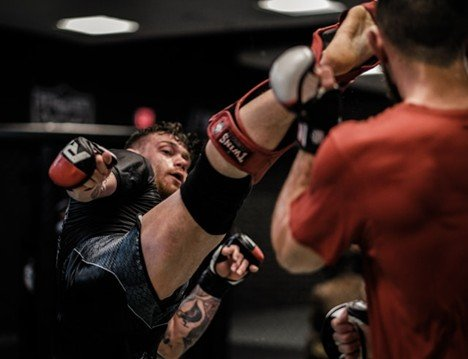
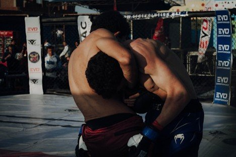

# How Martial Arts Became a Lifestyle, Not Just a Sport

# How Martial Arts Became a Lifestyle, Not Just a Sport

Nov 4

Written By [Webi Max](/blog?author=6480d62bd9ff5d5f7d3930b3)

For years, martial arts were seen mainly as a competitive discipline; a test of strength, skill, and endurance between athletes seeking victory on the mat or in the ring. But today, a quieter revolution is reshaping this ancient practice. Across the country, training spaces are filling with students who aren’t chasing medals but personal growth.

Martial arts have become more than a sport, they’ve become a way of life. For those drawn to [BJJ in Renton, WA](https://www.ruffhouserenton.com/jiu-jitsu), people are finding meaning, mindfulness, and community in the rhythm of training, not just in competition.

## **The Shift from Competition to Connection**

The traditional image of martial arts often centers on tournaments, black belts, and trophies. These are symbols of success that defined progress for decades. But, the meaning of “success” has changed. Modern practitioners are drawn to martial arts not because they want to fight others, but because they want to understand themselves.

For many, the dojo or academy has become a second home; a place to relieve stress, strengthen discipline, and connect with like-minded individuals. The appeal lies less in combat and more in consistency. Students learn that progress is built on repetition, patience, and humility, values that spill over into everyday life.

The sense of belonging that develops through martial arts communities is also a powerful motivator. Classes mix individuals from all walks of life: professionals, students, parents, and retirees all training side by side, sharing the same sweat, challenges, and breakthroughs. The result is a kind of collective self-improvement that transcends competition.

## **Why Martial Arts Appeals to the Modern Lifestyle**

The rise of recreational martial arts mirrors a broader societal shift toward wellness and self-development. Many adults today are seeking outlets that [blend physical activity with mental clarity](https://pmc.ncbi.nlm.nih.gov/articles/PMC10819297/), a balance that traditional gym workouts often lack. Martial arts provide this dual benefit.

MMA training engages the body and the mind simultaneously. Each session demands focus, awareness, and adaptability. The techniques challenge coordination, but also patience and emotional control. This combination creates a uniquely meditative experience, one that feels as restorative as it is empowering.

Training can fit neatly into modern wellness trends: mindfulness, mobility, and mental resilience. In a world saturated with digital distractions and daily stressors, time spent on the mat offers a rare form of presence. Practitioners report improvements in focus, stress management, and sleep quality, benefits that extend far beyond the dojo.

## **The “Everyday Practitioner”**

Not long ago, martial arts schools were dominated by students training for tournaments, belt promotions, or even professional fighting careers. Today, a new demographic has emerged - the “everyday practitioner.” These are individuals who train for personal development rather than competition.

Their goals vary: some want to build confidence, others want to get fit, and many simply want to feel better in their own skin. What unites them is the pursuit of growth. The journey is internal rather than external, marked not by trophies or titles, but by the ability to stay calm under pressure or maintain composure after failure.

This approach has expanded the definition of what it means to “succeed” in martial arts. Success might mean showing up to class three times a week, recovering from an injury, or finally mastering a difficult technique after months of frustration. The focus is no longer on defeating opponents, it’s on overcoming one’s own limitations.

## **The Dojo as a Modern Sanctuary**

Training centers have become sanctuaries of connection and structure. The format of bowing, repetition, partner drills establishes a rhythm that encourages respect and mutual growth. Unlike the competitive environments found in many other sports, martial arts culture often emphasizes mentorship and humility.

Beginners learn from advanced students, and those with more experience often feel a sense of responsibility to guide others. This mentorship model strengthens community bonds while reinforcing the values of discipline and empathy. Many practitioners describe the dojo as the one place in their day where they can disconnect from work, family pressures, and digital noise.

The rituals of martial arts also provide psychological grounding. The act of bowing before and after class, focusing on breathing, or simply maintaining eye contact during partner drills; all of these foster presence and gratitude. Over time, these small acts of mindfulness accumulate, shaping a more grounded and centered individual.

## **How Martial Arts Shapes the Whole Person**

MMA training influences more than just physical fitness. It also cultivates emotional intelligence, adaptability, and humility, qualities essential to personal and professional success.

Learning to handle pressure in sparring teaches practitioners to remain composed during real-world challenges. Repeatedly facing failure trains resilience. Practitioners begin to view obstacles as part of the process, not as barriers to avoid.

This mindset carries over into daily life. Many students report becoming calmer under stress, more confident in communication, and more deliberate in decision-making. The same patience and discipline required to master techniques translate directly to relationships, careers, and long-term goals.

Even the physical lessons have broader meaning. Balance, leverage, and timing aren’t just concepts used on the mat, they’re metaphors for how to navigate complex social and emotional situations. The longer one trains, the more these lessons intertwine, turning martial arts into a lifelong practice of self-awareness.

## **Cultivating Lifestyle Training**

Modern coaches understand that not every student is chasing competition glory. Many are there for health, balance, or personal growth.

This has shifted class dynamics. Instructors now emphasize safety, inclusivity, and adaptability. Classes may include mindfulness exercises, mobility training, or even discussions on mental discipline. The goal is to equip students not just with fighting techniques, but with life skills.

The best instructors recognize the mat as a microcosm of life: a place where people learn to manage fear, frustration, and ego in real time. By framing training as a personal journey rather than a path to victory, instructors create environments where everyone can thrive.

## **The Cultural Impact of Martial Arts as a Lifestyle**

As martial arts continue to evolve beyond the confines of competition, their cultural impact grows. Social media platforms are filled with individuals sharing their journeys, progress, and reflections, not to boast, but to inspire others to start.

This openness is helping reshape public perceptions of martial arts. It’s no longer just about fighting or self-defense; it’s about transformation. Many people now see MMA as a holistic approach to living well, blending physical health, mental focus, and emotional growth.

Families train together, companies incorporate leadership programs, and schools use martial arts principles to teach focus and respect. The art has transcended its origins, becoming a [universal language of discipline and self-betterment.](https://immaf.org/2020/07/15/immaf-launches-peace-through-mma-commission/)

## **A Lifelong Practice, Not a Phase**

For those who embrace martial arts as a lifestyle, training becomes a lifelong practice rather than a temporary hobby. The mat becomes a mirror reflecting strengths, weaknesses, and everything in between. Over time, the distinction between “training” and “life” begins to blur.

Each class reinforces lessons that apply everywhere: patience, humility, consistency, and respect. And as practitioners mature, they often find themselves sharing these lessons with others, as instructors, mentors, or simply as better human beings.

Whether someone trains twice a week or dedicates their life to the craft, the benefits are deeply personal and enduring.

## **The Bottom Line**

Martial arts have evolved far beyond the pursuit of medals and competition. In today’s world, they represent a philosophy of living, one that blends physical movement with mental clarity and community connection.

The growing community of recreational practitioners has proven that the sport just for fighters; they’re for anyone seeking balance, purpose, and resilience in an unpredictable world. What begins as a fitness routine often becomes something far greater, a lifelong path toward mastery, mindfulness, and meaning.

[Webi Max](/blog?author=6480d62bd9ff5d5f7d3930b3)