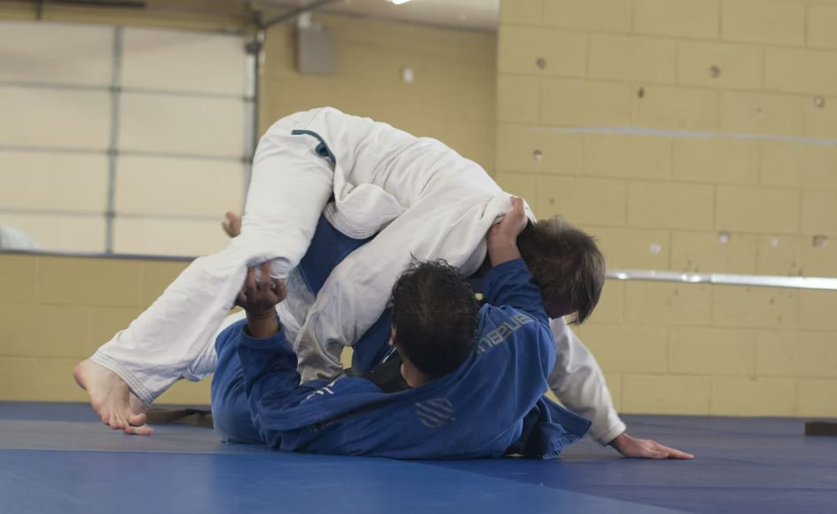
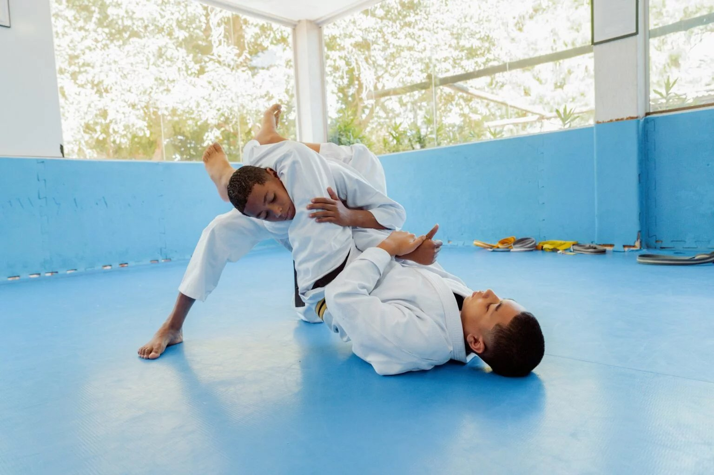

# How Martial Arts Improve Physical Fitness

# How Martial Arts Improve Physical Fitness

Feb 11

Written By [Webi Max](/blog?author=6480d62bd9ff5d5f7d3930b3)

Various forms of mixed martial arts are renowned for their intense ground fighting and submission techniques, but their impact goes far beyond the mat, offering a wealth of physical, mental, and strategic benefits. As practitioners roll, spar, and drill, they are engaging in one of the most comprehensive full-body workouts available. Training in [Brazilian Jiu-Jitsu in Renton, WA](https://www.ruffhouserenton.com/jiu-jitsu), is an excellent way to improve physical fitness, enhancing strength, endurance, flexibility, and overall cardiovascular health. Whether you’re a seasoned martial artist or a beginner just stepping onto the mat, this discipline provides a diverse and challenging training regimen that enhances your physical fitness in ways few other workouts can match.

## **Strength Development**

One of the primary physical benefits of practicing this type of training is the significant improvement in overall strength. It isn’t about pure strength or power in the traditional sense, but rather about applying techniques to use leverage and positioning to control opponents. Despite this, training builds strength, particularly in the muscles of the core, upper body, and lower body.

## **Core Strength**

The foundation of [BJJ in Renton, WA](https://www.ruffhouserenton.com/jiu-jitsu) lies in using the core muscles—abdominals, obliques, and lower back—for nearly every technique. Whether you’re trying to maintain guard, execute a sweep, or perform a submission, the movements require constant stabilization from the core. Practitioners engage their core muscles throughout each practice, leading to stronger abs, lower back muscles, and hip flexors. This increase in core strength also improves balance and stability, both on and off the mat.

## **Upper Body Strength**

Practitioners also develop substantial upper body strength, especially in the shoulders, arms, and hands. A significant portion of martial arts training involves gripping, pulling, and pushing, which is why grapplers often have stronger biceps, triceps, and forearms. The act of holding someone in a dominant position or attempting to submit them requires a great deal of upper body strength. Furthermore, controlling the opponent’s wrists or collar and using forceful movements, such as armbars and kimuras, further enhances arm strength and shoulder stability.

## **Lower Body Strength**

Although sparing primarily focuses on ground combat, lower body strength plays an integral role in executing sweeps, escapes, and guard work. Practitioners use their legs for sweeping opponents, maintaining guard, and in transitions between positions. The constant pressure from moving, shifting, and using the legs to control or submit opponents strengthens the quadriceps, hamstrings, glutes, and calves. Additionally, the explosive nature of certain techniques, such as bridging or standing to break the guard, can develop fast-twitch muscle fibers that contribute to overall leg strength.

## **Cardiovascular Endurance**

MMA is a highly demanding sport that requires both [aerobic and anaerobic endurance](https://pmc.ncbi.nlm.nih.gov/articles/PMC6090403). The nature of training, such as moving quickly from one position to another, resisting submissions, and performing constant movement in a sparring session—engages your heart and lungs, pushing them to keep up with the pace.

## **Aerobic Endurance**

During rolling (sparring), practitioners engage in extended bouts that typically last anywhere from five to ten minutes. In these sessions, athletes are constantly moving, working at various intensities. The more you train, the better your aerobic endurance becomes. Over time, you’ll notice that you’re able to recover more quickly between rounds and maintain a steady level of energy throughout longer sessions.

## **Anaerobic Endurance**

Anaerobic endurance is equally important in the sport. It refers to high-intensity efforts that involve short bursts of power, such as exploding into a sweep or working to escape a submission. It requires a great deal of anaerobic fitness, as the sport involves repeated short, explosive efforts followed by brief recovery periods. These rapid bursts of energy help build endurance for those intense moments during sparring, where sudden acceleration or effort is required to escape or submit an opponent.

## **Flexibility**

Flexibility is a significant but often overlooked benefit of training. The constant movement and stretching helps to increase overall flexibility, particularly in the hips, hamstrings, and lower back.

## **Hip Flexibility**

Guard positions, sweeps, and submissions require a practitioner to maintain various postures that stretch and open the hips in ways that few other activities can. This improves overall hip mobility, making it easier for practitioners to transition between positions and control opponents. Hip flexibility is crucial for maintaining good guard control, for example, as it allows the athlete to retain positioning and fluidly adjust to an opponent's movement.

## **Hamstring and Lower Back Flexibility**

Training and techniques such as high bridges, forward rolls, and inverted guard work stretch the lower back and hamstrings, improving flexibility and reducing the risk of injury. Many practitioners find that their hamstring and lower back flexibility increases significantly as they train, allowing them to move more fluidly and perform a variety of positions with greater ease.

## **Overall Physical Fitness**

In addition to improving strength, endurance, and flexibility, it provides a full-body workout that engages almost every muscle group. The dynamic nature of the sport leads to better coordination, agility, and overall athleticism.

## **Coordination and Agility**

Athletes must develop excellent coordination between their upper body and lower body, ensuring they can fluidly execute techniques and counter their opponent's movements. For example, while working in a guard position, you need to coordinate arm movements with leg sweeps or submissions while maintaining balance. This complex coordination helps improve general athletic ability, which can be beneficial for other physical activities.

## **Weight Loss and Fat Burning**

As a result of the high-intensity nature of the sport, it is also an excellent form of cardiovascular exercise that aids in weight loss. By consistently training, individuals can burn calories, reduce body fat, and maintain a healthy weight. The combination of muscle engagement and aerobic exertion ensures that practitioners are not only getting stronger but are also improving their body composition.

## **Injury Prevention and Recovery**

Ironically, despite the physical demands and contact involved, it can help prevent injuries, especially those related to joint and muscle strain. The sport’s focus on controlled movement, proper technique, and flexibility all contribute to reducing the likelihood of overuse injuries. Many practitioners also develop joint mobility and muscle recovery strategies as they practice techniques such as joint locks, stretches, and post-training recovery routines.

The emphasis on using proper technique also reduces the risk of strain and injury, as the martial art teaches practitioners to rely on leverage, timing, and skill rather than raw strength or force.

## **Conclusion**

By engaging nearly every muscle group in the body, mixed martial arts enhance strength, cardiovascular endurance, flexibility, and overall physical health. Whether you’re looking to get stronger, improve your fitness, or boost your endurance, MMA offers a challenging yet rewarding path to achieve these goals. For anyone interested in improving their physical fitness, BJJ is an incredibly effective and holistic approach that provides lifelong benefits—both in the gym and in daily life.

[Webi Max](/blog?author=6480d62bd9ff5d5f7d3930b3)