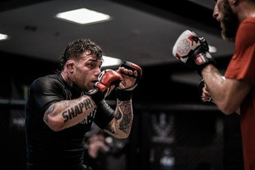
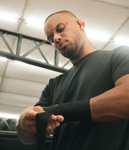
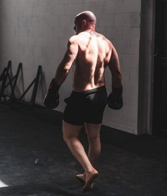

# How Rest and Injury Prevention Can Extend a Fighter’s Career

# How Rest and Injury Prevention Can Extend a Fighter’s Career

Apr 1

Written By [Webi Max](/blog?author=6480d62bd9ff5d5f7d3930b3)

Mixed Martial Arts is widely regarded as one of the most physically demanding sports, pushing athletes to their limits through intense training, sparring, and high-stakes competition. With the constant pressure to perform at an elite level, it's easy for fighters to be tempted to overtrain and push their bodies beyond their capacity. However, the most successful fighters know that hard training is only part of the equation. To achieve sustained success and extend their careers, athletes must make recovery, rest, and injury prevention a top priority.

Incorporating proper rest and injury prevention strategies is critical for ensuring that fighters can maintain peak performance without sacrificing their long-term health. For those training in [Brazilian Jiu-Jitsu in Renton, WA](https://www.ruffhouserenton.com/jiu-jitsu), rest and physiotherapy can contribute to a longer, healthier, and more successful MMA career.

## **The Importance of Rest**

[Rest is the foundation of any successful recovery regimen](https://www.uchealth.org/today/rest-and-recovery-for-athletes-physiological-psychological-well-being/). While training and sparring push a fighter's body to its limits, rest provides the necessary time for muscles, ligaments, and joints to repair and rebuild. Without adequate rest, a fighter risks overtraining, which can lead to fatigue, injury, and mental burnout. In fact, a lack of rest can be more detrimental to a fighter's career than overtraining.

## **The Role of Sleep in Recovery**

One of the most critical aspects of rest is sleep. During sleep, the body undergoes [various restorative processes](https://www.ncbi.nlm.nih.gov/books/NBK482512/), including muscle repair, hormone regulation, and tissue regeneration. Sleep also plays a vital role in cognitive function, mood regulation, and focus—all of which are essential for an MMA fighter’s performance both in training and in the cage.

Fighters should aim for at least 7-9 hours of quality sleep each night, as this allows the body to recover effectively from training sessions and competitions. Additionally, some fighters may benefit from power naps during the day to help alleviate fatigue and enhance recovery. Maintaining a consistent sleep schedule and prioritizing sleep hygiene can significantly improve performance, mental clarity, and overall well-being.

## **The Power of Active Rest**

While complete rest (such as sleeping or taking days off from intense training) is important, active rest is also essential for maintaining fitness without overstressing the body. Active rest refers to low-intensity activities that allow the body to recover while still promoting circulation and flexibility. These activities may include light jogging, swimming, yoga, or stretching.

Active rest helps reduce muscle stiffness, increase blood flow, and maintain mobility without subjecting the body to the same stress as high-intensity training. By incorporating active rest into their recovery routines, fighters can keep their cardiovascular system engaged, while also allowing the muscles to recover and stay flexible.

## **Physiotherapy and Injury Prevention**

Injuries are an unfortunate reality in MMA, but they don’t have to derail a fighter’s career if properly managed. Physiotherapy is an invaluable tool in both injury recovery and injury prevention. Physiotherapists specialize in diagnosing and treating musculoskeletal issues, and their expertise can be essential in helping fighters recover from injury and avoid future problems.

## **Prehab: Preventing Injuries Before They Happen**

Prehabilitation (often referred to as "prehab") is the practice of addressing potential injury risks before they occur. Prehab exercises focus on strengthening the muscles and joints that are most vulnerable to injury, such as the shoulders, knees, and lower back. By performing prehab exercises regularly, fighters can strengthen weak areas and reduce the risk of strain or injury during training or competition.

For instance, fighters can work on shoulder stability exercises to prevent rotator cuff injuries, which are common in MMA due to the heavy reliance on grappling and striking techniques. Likewise, core strengthening exercises can help prevent lower back injuries, which often occur from the high-impact nature of the sport. Prehabilitation not only prevents injury but also improves a fighter’s overall performance by addressing weaknesses and imbalances in the body.

## **Rehabilitation: Recovering from Injury**

When an injury does occur, prompt rehabilitation is critical to preventing long-term damage and ensuring a swift recovery. Physiotherapy techniques, such as manual therapy, stretching, and strengthening exercises, can help address specific injuries by restoring mobility, reducing pain, and promoting tissue healing.

In the case of sprains, strains, or fractures, physiotherapists often use a combination of modalities, such as ice, heat, ultrasound, and electrical stimulation, to reduce inflammation and promote healing. A customized rehabilitation plan, designed by a skilled physiotherapist, allows fighters to regain strength and mobility in the injured area while avoiding further strain on the body.

Fighters who engage in consistent physiotherapy during their careers are better equipped to handle the physical demands of the sport and can bounce back from injuries more effectively. Furthermore, by working with a physiotherapist, fighters can gain a deeper understanding of their bodies, allowing them to make adjustments to their training regimens and prevent re-injury.

## **Alternative Recovery Methods**

Beyond traditional rest and physiotherapy, MMA fighters can benefit from alternative recovery methods that help speed up healing, reduce pain, and improve overall wellness. These techniques complement rest and physiotherapy, providing a holistic approach to injury prevention and career longevity.

## **Cryotherapy: Reducing Inflammation and Promoting Healing**

Cryotherapy is the practice of exposing the body to extremely cold temperatures, typically through ice baths or whole-body cryo chambers, in order to reduce inflammation and promote muscle recovery. Many MMA fighters use cryotherapy as part of their recovery regimen to speed up healing and reduce soreness after intense training sessions.

The cold temperature stimulates vasoconstriction, which helps reduce inflammation and flush out metabolic waste products from the muscles. Once the body returns to normal temperature, blood vessels dilate, allowing fresh, oxygen-rich blood to flow back into the tissues and promote healing. This process accelerates recovery and reduces the risk of muscle soreness, allowing fighters to train harder and more frequently without overtaxing their bodies.

## **Massage Therapy: Easing Muscle Tension**

Massage therapy is a well-established recovery method used by athletes across all sports, including MMA. By manipulating the soft tissues of the body, massage helps alleviate muscle tension, increase blood circulation, and promote relaxation. Regular massage therapy can reduce muscle tightness, improve flexibility, and promote faster healing from injuries.

MMA fighters often use deep tissue massage, trigger point therapy, and myofascial release techniques to address specific areas of muscle tightness and stiffness. These treatments can also help to break down scar tissue and prevent adhesions, ensuring that muscles and tendons remain supple and functional. Incorporating massage therapy into a fighter’s recovery routine can improve both performance and overall well-being.

## **Nutritional Support and Supplements**

Diet and nutrition play a critical role in a fighter’s recovery process. The body needs the proper nutrients to repair muscles, reduce inflammation, and replenish energy stores after a hard training session or fight. Protein is especially important for muscle recovery, as it provides the building blocks necessary for tissue repair. Fighters should aim to consume high-quality protein sources, such as lean meats, fish, eggs, and plant-based proteins, to promote muscle growth and recovery.

Additionally, supplements such as omega-3 fatty acids, glutamine, and collagen can support joint health and reduce inflammation, while electrolytes and carbohydrates help replenish energy levels after intense workouts. Working with a nutritionist or dietitian to develop a balanced, nutrient-rich diet can help fighters optimize their recovery and performance.

## **Conclusion**

MMA is a brutal and unforgiving sport, and the physical toll it takes on athletes cannot be understated. However, with proper rest, injury prevention, and recovery techniques, fighters can not only reduce the risk of injury but also extend their careers and continue competing at the highest level for years to come. Prioritizing sleep, active rest, and physiotherapy ensures that fighters recover fully from each training session, while alternative recovery methods like cryotherapy and massage therapy can further enhance healing.

By integrating these practices into their training routines, MMA fighters can take a proactive approach to injury prevention, allowing them to remain healthy, avoid burnout, and perform at their peak when it matters most. In a sport where longevity is often elusive, focusing on recovery and injury prevention is the key to maintaining a successful and enduring career in MMA.

[Webi Max](/blog?author=6480d62bd9ff5d5f7d3930b3)