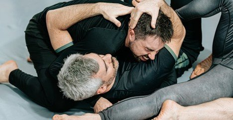

# How to Improve Your Submission Game

# How to Improve Your Submission Game

Dec 4

Written By [Webi Max](/blog?author=6480d62bd9ff5d5f7d3930b3)

Mastering submissions remains one of the most compelling and challenging elements of grappling and MMA. Anyone who trains in a large competitive academy or a smaller community like those practicing [BJJ in Renton, WA](https://www.ruffhouserenton.com/), quickly learns that submissions rely far more on precision, timing, and leverage than on raw power. Elevating your submission game demands strategic thinking, consistent drilling, positional awareness, and strong mental discipline. Although the learning curve can feel steep, approaching your training with a clear, methodical plan can significantly boost your confidence and effectiveness on the mats. This article breaks down actionable techniques, training concepts, and mindset strategies to help you sharpen and expand your submission arsenal.

## **The Fundamentals First**

Beginners and intermediate athletes often make the mistake of chasing flashy moves without fully mastering the basics. Core principles include:

**Leverage over strength:** Positioning and leverage allow you to apply submissions efficiently, regardless of your size.

**Control before submission:** Always secure dominant positions, mount, side control, back control, before attempting a submission.

**Hip and body positioning:** Small adjustments in your hips, shoulders, or angle can dramatically increase your effectiveness.

By understanding these fundamentals, every submission attempt becomes safer, more effective, and less reliant on brute force.

## **Drill Regularly**

Repetition is critical to internalizing techniques. Drilling allows your body to instinctively respond in live situations. Key tips for effective drilling include:

**Start slowly:** Begin at a controlled pace to ensure correct mechanics. Speed comes later.

**Focus on transitions:** Submissions are rarely set up in isolation; they come from sweeps, escapes, and positional shifts. Drill the movements that lead into the submission.

**Use progressive resistance:** As you improve, have your training partners provide realistic resistance to simulate live rolling.

Drills can include practicing specific joint locks, choke variations, or setups from key positions like mount, guard, and back control. Repetition will help you build muscle memory and recognize opportunities instinctively.

## **Prioritize Positional Control**

A strong submission game is built on dominant positions. Without control, even a technically perfect submission can fail. Focus on:

**Mount and back control:** These positions give the highest success rates for submissions and allow for effective control of your opponent.

**Guard management:** Whether top or bottom, understanding how to use your guard to control posture and limit movement is crucial.

**Transitions:** Moving fluidly between positions, such as passing guard to mount or taking the back, opens up more submission options.

Spending time refining positional control ensures that when the opportunity for a submission arises, you’re already in the optimal position to capitalize on it.

## **Study and Expand Your Submission Repertoire**

While it’s tempting to rely on a few go-to moves, a well-rounded grappler understands multiple options. Focus on:

**High-percentage submissions:** Moves like the rear-naked choke, armbar, and triangle are effective across many skill levels.

**Situational submissions:** Develop techniques for specific scenarios, such as defending against a pass or attacking from closed guard.

**Chains and combinations:** Learn to flow from one submission to another if the first attempt fails. For example, transitioning from a failed armbar to a triangle or omoplata increases your finish rate.

Regularly studying matches, tutorials, and seminars will expose you to new setups and variations, helping you adapt in live situations.

## **Improve Timing and Sensitivity**

Submissions often succeed because of timing rather than brute force. Developing sensitivity to your opponent’s movements is key:

**Feel for resistance:** A slight shift in tension can indicate an opening for a submission.

**Capitalize on mistakes**: Watch for moments when your opponent exposes limbs or loses balance, these are prime opportunities.

**Stay patient:** Forcing a submission prematurely can lead to escapes or reversals. Patience often leads to cleaner, higher-percentage finishes.

Rolling with experienced partners is one of the best ways to develop timing, as they provide realistic resistance and unpredictable reactions.

## **Strength and Conditioning for Submission Success**

While technique outweighs raw strength, physical conditioning still plays a role:

**Grip strength:** Strong grips enhance your ability to secure chokes and control limbs.

**Core strength**: A solid core improves stability, balance, and the ability to generate leverage.

**Endurance:** Submission attempts require sustained control and energy. Cardiovascular and muscular endurance ensures you maintain pressure without fatiguing.

Integrating functional strength and conditioning into your routine will support your technical skills, allowing you to execute submissions more effectively during extended rolls or competitions.

## **Mental Focus and Strategy**

Your mindset can significantly impact submission success:

**Visualize submissions**: Mentally rehearsing techniques strengthens neural pathways and improves recall during sparring.

**Analyze opponents:** Recognize patterns and tendencies in your training partners to anticipate openings.

**Stay calm under pressure:** Nervousness can cause rushed or sloppy attempts. [Focused breathing and mental composure](https://www.calm.com/blog/how-to-stay-calm-under-pressure) improve execution.

Combining mental preparation with technical training ensures you are ready to act decisively when opportunities arise.

## **Safety and Injury Prevention**

Submission training carries inherent risk, so prioritizing safety is crucial:

**Tap early, tap often:** Both giving and receiving taps prevent injuries and foster a learning environment.

**Controlled drilling:** Avoid excessive force during practice, especially with joint locks and chokes.

**Proper warm-up**: Prepare muscles, joints, and ligaments to reduce the chance of strain.

A safe training environment allows you to consistently practice submissions, accelerating skill development without setbacks.

## **Learning from Competition and Sparring**

Competition offers valuable feedback that drills alone cannot provide:

**Identify weaknesses:** Matches highlight areas where you struggle to secure submissions.

**Test setups in real time:** Competitions force you to execute techniques under pressure and resistance.

**Adaptability:** Learning to adjust when opponents counter your submissions strengthens your overall game.

Even non-competitive practitioners benefit from controlled sparring sessions that simulate the intensity and unpredictability of matches.

## **Continuous Learning and Community Engagement**

Finally, improving your submission game is a lifelong journey:

**Attend seminars:** Learning from experts exposes you to fresh techniques and strategies.

**Watch instructional content:** Break down high-level grappling videos to understand setups, transitions, and timing.

**Train with diverse partners:** Rolling with different body types and skill levels challenges you to adapt and refine your submissions.

Being part of a supportive grappling community fosters accountability, motivation, and the opportunity to learn from others’ experiences.

## **Conclusion**

Improving your submission game requires a combination of technical skill, strategic thinking, physical conditioning, and mental focus. By drilling fundamentals, prioritizing positional control, expanding your submission repertoire, and learning to read your opponent’s movements, you can dramatically increase your effectiveness on the mat. Strengthening your body, refining your timing, and maintaining safety ensures consistent progress, while competitions and community engagement accelerate learning.

A systematic, patient approach, coupled with guidance from experienced coaches and training partners, will help you unlock your full potential, turning submission opportunities into consistent successes. Whether you are rolling recreationally or preparing for competition, integrating these strategies into your training routine will make you a more confident, adaptable, and skilled grappler.

[Webi Max](/blog?author=6480d62bd9ff5d5f7d3930b3)