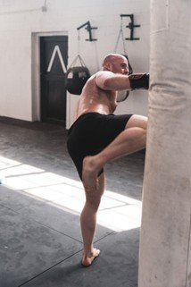
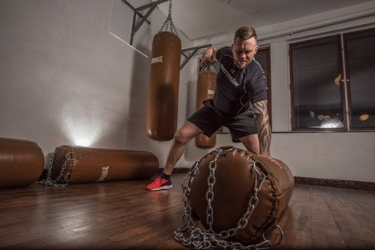

# The Evolution of MMA Fighters' Training Regimens

# The Evolution of MMA Fighters' Training Regimens

Mar 3

Written By [Webi Max](/blog?author=6480d62bd9ff5d5f7d3930b3)

Mixed Martial Arts (MMA) has evolved dramatically since its inception in the early 1990s, both as a sport and in terms of the physical preparation required to succeed at the highest level. Fighters have always needed a unique combination of strength, speed, stamina, technique, and mental resilience. However, as the sport has matured, so too have the training regimens that fighters use to prepare themselves. What was once a relatively rudimentary training process developed into a sophisticated, multi-disciplinary system, incorporating innovations in strength and conditioning, recovery, and the integration of advanced training tools.

For fighters in areas like [Brazilian Jiu Jitsu in Renton, WA](https://www.ruffhouserenton.com/jiu-jitsu), training has become increasingly specialized, with athletes focusing on different disciplines to round out their skill sets.

In this article, we will explore how training routines for MMA fighters have evolved over the years, highlighting key innovations in various aspects of training that have contributed to the sport’s progression.

## **The Early Days: Strength and Conditioning Basics**

In the early days, fighters often came from a background in one specific martial art, be it Brazilian Jiu-Jitsu, boxing, wrestling, or kickboxing. As a result, many early MMA athletes focused almost exclusively on their discipline, neglecting cross-training in other areas such as strength and conditioning, flexibility, and cardiovascular fitness.

Strength training was limited to basic bodybuilding exercises, with many athletes performing traditional lifts like bench presses, squats, and deadlifts. Conditioning focused mostly on the sport-specific needs of the individual fighter, but there was little regard for overall athletic development. Fighters would also spend time in the gym practicing their techniques but didn't necessarily follow structured programs for maximizing their physical potential.

The early training routines, while effective in the short term, often left gaps in athletes' overall performance. In many cases, fighters would gas out during long exchanges, which ultimately limited their chances of success.

## **The Introduction of Cross-Training and Strength and Conditioning Specialists**

By the late 1990s and early 2000s, the landscape of MMA began to change. Fighters started to realize the importance of cross-training in different disciplines, which meant not only mastering striking, and wrestling but also becoming well-rounded athletes. In response to this realization, fighters began incorporating more diverse training methods into their routines.

One of the most significant evolutions during this time was the rise of specialized strength and conditioning coaches who understood the unique demands of MMA. The focus shifted from just lifting weights to training athletes for explosiveness, endurance, and agility. Fighters began to use [high-intensity interval training (HIIT),](https://www.webmd.com/fitness-exercise/high-intensity-interval-training-hiit) circuit training, and [functional exercises](https://www.health.harvard.edu/exercise-and-fitness/three-moves-for-functional-fitness) to improve their athletic performance, with an emphasis on movements and exercises that mirrored the demands of the sport.

Additionally, more attention was given to injury prevention and mobility work. Fighters began incorporating yoga, Pilates, and foam rolling into their routines to help with flexibility and reduce the risk of injury. This shift toward a more holistic approach to training helped athletes improve their overall conditioning and reduce the wear-and-tear associated with intense fight preparation.

## **The Integration of Technology**

As technology advanced, so did the tools available to fighters for optimizing their training regimens. By the late 2000s and into the 2010s, fitness trackers, wearable tech, and performance monitoring systems became an integral part of the athlete's routine. These tools allowed fighters to track everything from heart rate and sleep patterns to the number of strikes thrown during training and recovery metrics.

The use of heart rate monitors and GPS tracking devices allowed coaches to measure the intensity of training sessions and adjust workouts to target specific energy systems (aerobic, anaerobic, etc.) to better simulate fight conditions. For example, sparring sessions could now be analyzed for how well an athlete maintained their cardio through multiple rounds of intense work, leading to more efficient training sessions.

Other tools like motion-capture systems, video analysis, and biomechanical feedback technology provided fighters with detailed insights into their movements and techniques. Fighters could see exactly where they were losing speed or power, allowing them to make targeted adjustments to their footwork, strikes, or grappling techniques.

## **The Science of Rest and Rehabilitation**

As the intensity of MMA training has increased, so has the focus on recovery. Fighters now understand that recovery is just as important as the training itself, as pushing the body too hard without sufficient rest can lead to injuries and burnout.

One of the most notable innovations in recovery has been the rise of cryotherapy, or cold therapy. Many fighters now use cryo-chambers, where they immerse their bodies in freezing cold air for several minutes to speed up muscle recovery and reduce inflammation. This practice has been shown to help fighters recover faster from intense training sessions, making them more prepared for their next workout or fight.

In addition to cryotherapy, techniques like active recovery, massage therapy, physical therapy, and even acupuncture have become popular in the MMA community. More fighters are also using devices like the NormaTec compression boots, which help improve circulation and reduce muscle soreness after training.

Sleep has also been recognized as a crucial element of recovery, with fighters using sleep tracking devices and adjusting their sleep routines to ensure they get the necessary rest to recover fully. Improved nutrition, hydration strategies, and supplementation have further enhanced fighters' recovery processes, with many now working with nutritionists to develop personalized meal plans that support muscle repair, energy levels, and long-term performance.

## **Mental Conditioning: The Psychological Edge**

As the sport of MMA has become more professional, mental toughness has also become a crucial part of a fighter’s training regimen. The psychological aspect of training and preparation has gained more attention, with sports psychologists and mental coaches working with athletes to improve focus, confidence, and resilience under pressure.

Techniques like visualization, positive self-talk, and meditation are now common components of MMA training regimens. Fighters are encouraged to mentally rehearse their fights, visualize success, and manage anxiety before and during competition. A strong mental game can help a fighter stay calm under pressure, recover from setbacks during a fight, and push through the pain and exhaustion that inevitably come with intense training.

## **Conclusion**

The evolution of MMA fighters' training regimens has been nothing short of revolutionary. What started as a basic focus on individual martial arts disciplines has grown into a multifaceted approach that incorporates strength and conditioning, recovery techniques, advanced technology, and mental training. Today’s fighters are not only more skilled but also more athletic, resilient, and better prepared than ever before. Practitioners of [BJJ in Renton, WA](https://www.ruffhouserenton.com/jiu-jitsu) have seen significant improvements in their overall training routines, as martial arts continue to integrate more comprehensive conditioning and mental strategies to optimize performance.

As the sport continues to grow and evolve, MMA training will undoubtedly keep adapting to new science, technology, and training methods. The future promises even more innovation in how athletes train, recover, and perform at the highest levels of competition, making MMA an even more exciting sport to watch and an even more challenging endeavor for its participants.

[Webi Max](/blog?author=6480d62bd9ff5d5f7d3930b3)