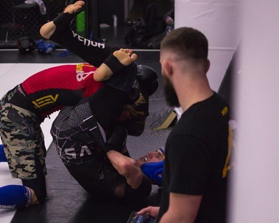

# Transitioning from Striking to Grappling: Key Concepts for Fighters

# Transitioning from Striking to Grappling: Key Concepts for Fighters

Jul 2

Written By [Ruffhouse Owner](/blog?author=6779a46a7232f91359aa8fc8)

In the diverse world of combat sports and mixed martial arts (MMA), fighters who excel often demonstrate versatility across multiple disciplines. One of the most critical skill transitions is moving effectively from striking — punches, kicks, knees, and elbows — to grappling, which includes clinching, takedowns, and ground fighting. Mastering this transition can make the difference between dominating an opponent and missing opportunities, especially as fights shift from stand-up exchanges to close-quarters combat.

For strikers aiming to expand their skill set by incorporating grappling, understanding the core principles behind this transition is crucial. Whether you're training locally or exploring options like [BJJ in Renton WA,](https://www.ruffhouserenton.com/jiu-jitsu) mastering the shift from stand-up to ground fighting can significantly elevate your overall game. This article outlines the key concepts every fighter should know to transition smoothly and effectively between striking and grappling phases.

## **Why Transitioning Matters**

Fights rarely stay in one phase. A boxer or kickboxer might land heavy shots, but an opponent skilled in wrestling or Brazilian Jiu-Jitsu can close the distance and bring the fight to the ground. Without the ability to transition effectively, a striker may find themselves vulnerable to takedowns or clinch control, limiting their offensive options.

Conversely, fighters who can blend striking with grappling create a dynamic and unpredictable attack. Effective transitions allow for controlling distance, setting up takedowns off strikes, escaping bad positions, and capitalizing on an opponent’s mistakes.

## **Understanding Distance and Range**

One of the most fundamental concepts in transitioning is controlling distance. Striking typically happens at a mid-to-long range, where punches and kicks have space to generate power. Grappling requires closing that distance to initiate clinches, takedowns, or ground control.

**Closing the Gap:** Fighters must learn to safely and efficiently close the distance without getting caught by strikes. This often involves using feints, head movement, footwork, and timing to slip inside an opponent’s striking range.

**Level Changes**: Dropping your center of gravity smoothly (a “level change”) signals your intention to grapple and helps prepare your body for takedowns or clinches.

**Angles:** Moving laterally or creating angles can help avoid strikes while setting up grappling entries.

Mastering distance management allows fighters to dictate when and how the transition happens rather than reacting defensively.

## **The Clinch as a Bridge**

The clinch is a critical intermediary zone between striking and grappling. It allows fighters to neutralize strikes, control opponents, and set up takedowns or throws.

**Control Points:** Effective clinching focuses on controlling key points such as the opponent’s head, neck, arms, or hips. Dominating these areas gives leverage for takedowns or restricting the opponent’s offense.

**Striking from the Clinch:** While clinching, fighters can still land knees, elbows, and short punches, keeping the opponent off-balance and hesitant.

**Transitions from the Clinch:** Good clinch work creates opportunities to transition into throws, trips, or ground fighting positions.

Training to blend strikes and grappling techniques within the clinch improves fluidity and effectiveness.

## **Takedown Setups Off Strikes**

Striking can be a powerful tool to set up takedowns, making the transition smoother and more effective.

**Feints and Timing**: Faking a strike can prompt an opponent to react defensively, creating openings for a shot.

**Striking Combinations:** Combinations like jab-cross to a level change can disguise takedown attempts and force opponents into vulnerable positions.

**Exploiting Defensive Habits:** Observing an opponent’s reaction to strikes—such as dropping hands or stepping back—helps identify moments to shoot for a takedown.

Integrating strikes and takedowns strategically increases the chances of successful transitions.

## **Defense Awareness**

For strikers, developing strong takedown defense is just as crucial as learning how to initiate takedowns. Without this skill, opponents can easily capitalize on the gaps during transitions. Training in disciplines like [Brazilian Jiu Jitsu in Renton, WA](https://www.ruffhouserenton.com/jiu-jitsu) can provide valuable techniques and experience to help fighters defend against takedowns and maintain control during close-range engagements.

**Sprawling:** This fundamental defense involves shooting the hips backward to counter an opponent’s takedown attempt.

**Underhooking and Frames:** Using underhooks (arms inside the opponent’s) and framing (using arms to create space) helps maintain balance and resist being controlled.

**Maintaining Posture:** Keeping a strong, upright posture reduces vulnerability and prepares the fighter to counter or disengage.

Effective takedown defense buys time to reset striking distance or reverse positions.

## **Ground Awareness and Escapes**

Once the fight hits the ground, transitioning fighters must know how to respond effectively.

**Positioning:** Understanding dominant positions like guard, half-guard, mount, and side control helps fighters navigate and defend on the mat.

**Escaping Bad Positions:** Learning how to escape from under mount or side control prevents damage and creates opportunities to return to standing.

**Basic Submissions Awareness:** Even strikers benefit from knowing common submissions like rear-naked choke or armbar to avoid traps.

Having basic grappling survival skills is essential during transitions and when the fight goes to the mat.

## **Conditioning and Mindset**

Transitions require not only skill but also physical conditioning and mental adaptability.

**Explosive Power and Endurance:** Closing distance and defending takedowns demand bursts of energy and sustained cardiovascular fitness.

**Mental Preparedness**: Accepting the fluid nature of combat and embracing grappling elements reduce hesitation and improve reaction times.

**Sparring Drills:** Training with live sparring that focuses on striking-to-grappling transitions builds confidence and instinctive responses.

A well-conditioned body and a flexible mindset are vital for mastering transitions.

## **Practical Tips for Fighters Making the Transition**

Start with Basics: Focus on learning [fundamental wrestling](https://www.win-magazine.com/2024/06/03/10-coaching-fundamentals-to-help-all-young-wrestlers/) and grappling movements before advancing to complex techniques.

**Drill Entry Techniques**: Practice level changes, shots, and clinch entries repeatedly to build muscle memory.

**Partner with Grapplers**: Training with experienced grapplers accelerates learning and provides real-time feedback.

**Integrate Striking and Grappling Workouts**: Don’t train skills in isolation; combine them in drills and sparring.

**Study Successful Fighters:** Analyze fighters like Georges St-Pierre, Israel Adesanya, or Valentina Shevchenko, who excel at blending striking and grappling.

## **Mastering the Shift**

Transitioning from striking to grappling is a critical skill for fighters seeking to become well-rounded competitors. Understanding distance management, clinch control, takedown setups and defenses, ground awareness, and the importance of conditioning all contribute to seamless movement between these combat phases.

By dedicating time to these key concepts, strikers can avoid being caught off-guard, capitalize on new offensive opportunities, and maintain control of the fight’s pace and positioning. In the evolving landscape of combat sports, versatility and fluidity between striking and grappling are essential ingredients for success.

[Ruffhouse Owner](/blog?author=6779a46a7232f91359aa8fc8)