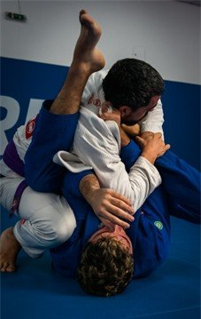
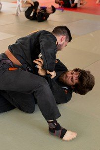

# What Tapping Early Teaches You About Confidence and Control

# What Tapping Early Teaches You About Confidence and Control

Aug 4

Written By [Ruffhouse Owner](/blog?author=6779a46a7232f91359aa8fc8)

In combat sports, few experiences are as revealing and humbling as the moment someone taps out. It’s a gesture that acknowledges physical limits, a conscious surrender that prioritizes safety and self-awareness over pride. To the untrained eye, tapping might appear as a form of defeat. But within disciplines like grappling, it’s regarded quite differently, especially during training. Tapping early is not a sign of weakness; it’s a powerful demonstration of emotional intelligence, self-control, and respect for both your training partner and your own growth.

The idea of voluntarily conceding might seem backwards. Yet on the mat, those quick taps are full of meaning. They show that you understand your limits, recognize the dynamics of a situation, and have nothing to prove. It's this level of self-awareness that sets seasoned practitioners apart. For those involved in [Brazilian Jiu Jitsu in Renton, WA](https://www.ruffhouserenton.com/jiu-jitsu), learning when and why to tap becomes a central lesson in maturity, control, and the kind of quiet confidence that can only be built through disciplined practice. The following articles takes a deep dive into how recognizing defeat in training builds emotional intelligence and humility.

## **The Subtle Art of Surrender**

Tapping early is not about quitting. It’s about control. It’s about knowing exactly when a position has been lost, a submission is inescapable, or your breathing has been compromised. It’s about avoiding ego-driven injuries and preserving longevity in the art. Most importantly, it’s about understanding your limitations in real-time and making peace with them.

This act requires a significant amount of inner strength. The moment you decide to tap, you confront your pride directly. Every instinct in your body may be urging you to resist, push harder, escape, prove something — but your mind must override those impulses with logic and foresight. It’s a skill not unlike emotional regulation in high-stress conversations or professional negotiations. It teaches that power isn’t always in domination, but in the discernment to know when to yield.

## **Building Humility Through Repeated Failure**

One of the most important lessons you learn early in grappling is that you will lose. Not once, not twice — but over and over again. Sometimes to people your size, sometimes to people far smaller, younger, or newer than you. And when you do lose, you’ll often be put into compromising positions where the only safe option is to tap. Early and often.

This repeated surrender conditions a humility that is hard to find elsewhere. You begin to respect your training partners not just for their technical ability, but for how they handle your vulnerability — and how you handle theirs. You grow to understand that you’re not invincible, that anyone can make mistakes, and that humility is a necessary companion on the path to skill.

The person who taps early and often is often the one progressing the fastest. Why? Because they’re focused on learning, not winning. They’re not caught up in their own self-image or reputation on the mat. They are willing to put themselves in bad positions, to try techniques that might fail, and to explore the edge of their capability. This [mindset](https://www.jongordon.com/positivetip/winlose.html) fosters long-term growth and resilience.

## **Confidence Without Aggression**

Ironically, tapping early can be one of the most confident things a person does on the mat. When you no longer fear the tap — and you’re willing to acknowledge when you're caught — you’re no longer ruled by insecurity. You don’t need to flail, thrash, or muscle out of bad positions. You don’t need to overcompensate for your lack of technique. You can simply breathe, assess, and choose your course of action with composure.

This kind of quiet, grounded confidence spills over into everyday life. It teaches you to stay calm under pressure, even when you’re metaphorically “under mount.” You develop the ability to remain collected when others lose control, and to handle adversity with grace. You also learn to detach your self-worth from outcomes. Whether you tap or not on any given day doesn’t define you; what matters is how you respond.

Over time, this becomes a foundation for [emotional maturity](https://americanbehavioralclinics.com/10-signs-of-emotional-maturity/). Confidence no longer stems from overpowering others or asserting yourself aggressively, but from deep, tested self-knowledge. You begin to trust your ability to assess situations clearly, to make thoughtful decisions under pressure, and to recover from setbacks without ego.

## **Letting Go of Ego: The Hardest Lesson**

The greatest barrier to tapping early is ego. Most people new to grappling, particularly those with athletic backgrounds or strong competitive instincts, struggle immensely with the idea of giving up control. The desire to fight through submissions, even when escape is unlikely, is often born of a need to prove toughness or avoid embarrassment.

Ego, while common in competitive spaces, is one of the quickest routes to both physical injury and personal stagnation. The practitioner who refuses to tap to a well-applied armbar might feel a momentary sense of toughness, but that choice can lead to serious ligament damage and months away from the mat. Similarly, resisting a choke past the point of safety might preserve pride for a few fleeting seconds, but it risks far greater consequences for long-term health. Even more detrimental is the mindset that prioritizes “not losing” over learning, where a fear of failure prevents experimentation, ultimately leading to a rigid, limited approach to training.

True progress comes from embracing vulnerability and using each round as an opportunity to grow, not prove something. In places like [BJJ academies in Renton, WA](https://www.ruffhouserenton.com/jiu-jitsu), students are regularly reminded that success isn’t about dominating every roll, it’s about expanding your understanding, refining your technique, and building resilience through thoughtful risk-taking and honest self-assessment.

In contrast, the grappler who sets ego aside opens up a much richer training experience. They begin to see the value in every exchange, not just in dominating or surviving. They learn from being mounted, from getting swept, from being submitted. And in this vulnerability, they find a kind of freedom; from self-judgment, from comparison, and from the fear of failure.

## **Training as a Mirror**

Training environments in martial arts are often described as mirrors. They reflect who we are under pressure, how we deal with adversity, and where our insecurities lie. On the mat, you can’t hide behind charm, status, or appearance. You either survive the position or you don’t. You either escape or you tap.

In this sense, tapping early is a form of deep personal honesty. It’s a statement that says, “I know where I am. I know what I can and cannot do. And I’m okay with that.” That kind of honesty, cultivated in physical practice, begins to transform the way you interact with the world. You become less reactive, less defensive. You’re more open to feedback, more aware of your limits, and more willing to grow from them.

This kind of self-awareness is at the heart of emotional intelligence. It allows you to communicate more clearly, to manage your reactions, and to build stronger relationships, both on and off the mat.

## **Control Without Dominance**

There’s a subtle but important difference between control and dominance. Dominance seeks to overpower. Control is about managing yourself and your environment wisely. Tapping early exemplifies the latter. You’re not giving up, you’re exercising agency. You’re making a conscious decision to preserve your body, learn from the moment, and return better the next time.

In many ways, this is the essence of martial arts. Not brute force or aggression, but mastery over self. And mastery over self begins with self-knowledge — the kind that can only be gained through failure, reflection, and growth.

## **Embracing the Tap**

Tapping early is one of the most paradoxical lessons in grappling. It looks like giving up, but it’s actually an advanced form of self-possession. It appears weak, but it requires great strength. It seems to concede control, but it demonstrates the deepest form of it.

In a culture obsessed with never backing down, learning when to yield is a radical act of maturity. The tap, particularly the early tap, becomes a tool of transformation — building confidence rooted in self-awareness, fostering humility through vulnerability, and cultivating emotional intelligence in a space where physicality often takes center stage.

So the next time you tap early, don’t beat yourself up. Smile. Breathe. Learn. You just exercised a level of control and courage that most people never discover — and you’re better for it.

[Ruffhouse Owner](/blog?author=6779a46a7232f91359aa8fc8)