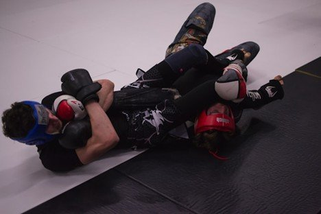
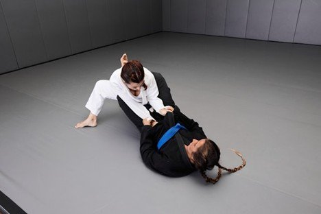

# Why Ground Control Often Decides the Fight

# Why Ground Control Often Decides the Fight

Oct 3

Written By [Ruffhouse Owner](/blog?author=6779a46a7232f91359aa8fc8)

In combat sports, particularly mixed martial arts and submission grappling, the ability to control your opponent on the ground can be the difference between victory and defeat. Fighters often spend years perfecting striking, but it is the mastery of ground positioning that frequently dictates the flow of a bout. For those training in [BJJ in Renton, WA](https://www.ruffhouserenton.com/jiu-jitsu), understanding and implementing ground control strategies is central to achieving success on the mat. From pinning techniques to positional dominance, controlling an opponent once the fight hits the floor allows athletes to dictate pace, neutralize threats, and set up submissions with precision.

Ground control is more than simply being on top; it is about leverage, balance, and timing. Effective fighters use their weight distribution, grips, and movement to restrict their opponent's options while conserving energy for offensive maneuvers. In a sport where exhaustion can quickly lead to mistakes, controlling an opponent efficiently often provides both a tactical and psychological edge. Being able to dictate where the fight happens—whether it’s against the cage, in the center of the mat, or on the ground—gives a fighter the upper hand in nearly every scenario.

## **The Mechanics of Positional Dominance**

The foundation of ground control lies in understanding the hierarchy of positions. From the top, positions such as mount, side control, and back control offer distinct advantages. Mounting an opponent, for instance, allows the fighter to deliver strikes safely while limiting the opponent's ability to counterattack. Side control provides stability and opens opportunities to transition to more dominant positions or set up submissions. Back control, arguably the most advantageous position in grappling, enables choke attempts while significantly reducing the opponent’s defensive options.

Success in these positions is not solely dependent on strength but on technical skill. Proper weight distribution, [hip placement](https://www.elitesports.com/blogs/news/5-effective-ways-to-maintain-back-control-in-bjj-and-mma), and controlling the opponent's limbs are critical. Even a smaller fighter can dominate a larger opponent with precise technique, demonstrating that ground control relies as much on leverage and timing as it does on power. Coaches emphasize this principle in training, reinforcing that understanding mechanics and body positioning is often more effective than raw force.

## **The Role of Pressure and Weight**

One of the key aspects of effective ground control is pressure. Applying weight strategically can limit an opponent's breathing, sap energy, and reduce their mobility. This technique is common in Jiu Jitsu, where using the body as a living barrier prevents escapes and forces mistakes. By maintaining consistent pressure, a fighter can make even minor openings significant, turning small advantages into submission opportunities.

Weight and pressure are not applied indiscriminately; proper distribution ensures the controlling fighter remains balanced and ready to respond to counters. Fighters are trained to feel shifts in their opponent’s movement, allowing them to adjust dynamically. This continuous feedback loop between action and reaction is what separates competent grapplers from truly elite practitioners.

## **Ground Control in Mixed Martial Arts**

While grappling alone can dominate submission matches, in mixed martial arts, controlling the ground also opens striking opportunities. A fighter who secures top position can land effective [ground-and-pound](https://www.elitesports.com/blogs/news/what-is-ground-and-pound-in-mma-ultimate-guide), scoring points with judges and wearing down the opponent. Even when submissions are not immediately available, the ability to maintain control frustrates the opponent, forcing defensive movements that create openings for further attacks.

The mental aspect of ground control cannot be overstated. Fighters often experience a sense of helplessness when pinned, which can lead to mistakes. A skilled grappler exploits this psychological component, maintaining calm while the opponent becomes increasingly desperate. This mental dominance complements the physical advantage, making ground control a multi-dimensional tool in competitive fighting.

## **Training for Control**

Achieving mastery of ground control requires dedicated training. Drills that focus on positional transitions, escapes, and submissions develop muscle memory and intuition. Sparring sessions for those training [Brazilian Jiu Jitsu in Renton, WA](https://www.ruffhouserenton.com/jiu-jitsu), emphasize live application of these skills, helping fighters learn to maintain composure under pressure. By repeatedly practicing control in dynamic situations, athletes gain the confidence and awareness needed to make real-time adjustments during a fight.

Timing is equally critical. Recognizing when to apply pressure, when to transition between positions, and when to attempt a submission often determines the outcome of a match. Fighters are taught to read subtle cues from their opponent’s posture, breathing, and movements, using these signals to anticipate and counter reactions. The synergy of technique, timing, and strategic thinking is what makes ground control such a decisive factor.

## **Common Mistakes and Misconceptions**

Many fighters, especially those with a striking background, underestimate the complexity of ground control. A common mistake is relying solely on strength, which can lead to fatigue and ineffective positioning. Another misconception is that being on top automatically guarantees dominance; without proper technique, an opponent can exploit even minor errors to escape or reverse positions.

Additionally, fighters may neglect the importance of controlling not just the torso, but the opponent’s limbs. Failing to isolate arms or hips can allow escapes or counterattacks. Effective ground control involves a combination of pressure, positional awareness, and hand and leg placement, all coordinated to restrict the opponent’s mobility while maintaining readiness to capitalize on openings.

## **Strategic Applications in Competition**

Ground control is often most evident in strategic match planning. Coaches analyze opponents to identify weaknesses in defense, preferred positions, or susceptibility to specific transitions. By formulating a game plan centered around controlling the fight on the mat, athletes can exploit these tendencies while minimizing risks. Fighters who excel in ground control can dictate the pace of a match, conserve energy, and create situations where their opponent is forced to react rather than act proactively.

In tournaments and professional bouts alike, judges frequently reward control and dominance. Even if a submission is not achieved, maintaining positional superiority demonstrates technical skill and command of the fight. This often translates into points, further reinforcing why ground control is so heavily emphasized in training and competition.

## **Life Lessons in Control**

The principles learned through ground control extend beyond combat sports. Discipline, patience, awareness, and strategic thinking are cultivated through repeated practice of these techniques. Athletes learn to assess situations carefully, adjust to changing dynamics, and apply pressure without overcommitting. These lessons can be applied to personal, professional, and social challenges, highlighting the broader value of grappling beyond the competitive arena.

## **Crafting Your Path to Dominance**

For fighters aspiring to excel in combat sports, prioritizing ground control is essential. While striking and other aspects of fighting remain important, the ability to control opponents once the fight goes to the floor often dictates the outcome. Whether in training sessions at specialized gyms or in high-stakes competition, mastery of position, pressure, and timing gives athletes a decisive edge.

## **Securing Victory Through Mastery**

Understanding why ground control matters and dedicating the effort to master it can transform both performance and mindset. Fighters who commit to developing this skill not only gain technical superiority but also cultivate mental resilience, strategic awareness, and confidence. In the end, whether the fight is decided by points, submission, or dominance, those who control the ground often control the narrative, shaping outcomes in their favor and defining success in ways that extend far beyond the mat.

[Ruffhouse Owner](/blog?author=6779a46a7232f91359aa8fc8)